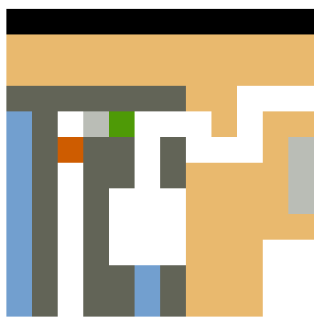

# Elm Pixel Boulder Game

The Elm Pixel Boulder Game is a bit "out-of-hand" experiment to write a game
 in a pure functional language.
I tried to apply [some tricks out of the books](https://github.com/MikeMcShaffry/gamecode4)
like the Actor-Component system which allows you to [configure the entities in assets](https://github.com/JordyMoos/elm-pixel-boulder-game/blob/master/src/static/levels/test/nes.json).

For years I wanted to build a [led table like this one (not mine)](./docs/img/sample-led-table.png).
Which I would probably do on a raspberry pi in Python.
One of the games I would like to make for it is the [old school Boulder Dash](https://www.google.com/search?q=boulder+dash&tbm=isch).
And I thought, if I could make Boulder Dash in a pure functional language like Elm.
Then I could probably write about any game you can create in a 12 by 12 pixels grid in Python.

This is also the reason why its all pixel-ish (the menu and some original levels).



When I showed people this they where like "mhe" until I decided to add images.
Suddenly it really looked like the old Boulder Dash!


## Play the game!

You can play the at github pages.

https://jordymoos.github.io/elm-pixel-boulder-game/?startLevel=official%2F001&hideDebug=1

## Easy level editor

You can [create and play your own levels in the visual editor](https://jordymoos.github.io/elm-pixel-boulder-game/?hideDebug=1).


And then play your own level!


https://jordymoos.github.io/elm-pixel-boulder-game/?hideDebug=1

## Advanced level editor

If you do not like the default configuration then [you can also use the advanced editor to configure more of your game](https://jordymoos.github.io/elm-pixel-boulder-game/?editorMode=advanced)!


https://jordymoos.github.io/elm-pixel-boulder-game/?editorMode=advanced

## Development

Clone the repo
```
git clone https://github.com/JordyMoos/elm-pixel-boulder-game.git
```
Go into the directory
```
cd elm-pixel-boulder-game
```
Install the dependencies
```
npm install
```
Run the local version
```
npm start
```
And play it in your browser at localhost:3000

## Create a prod build
After installing the depenencies you can also create a production build
```
npm run prod
```

Which will create the production version in the `./dist` folder
